# Лаба 2 - bad practices

В репозитории:
- `Dockerfile.bad` - плохой Dockerfile
- `Dockerfile` - хороший Dockerfile с исправлениями
- `app/server.py` - HTTP-сервер (слушает `0.0.0.0:8080`)

## 1. Сборка и запуск

### Настройка Docker

Установка через Colima:

```bash
brew install docker colima
colima start
docker version
```

### Сборка образов

```bash
# плохой
docker build -f Dockerfile.bad -t lab2-bad:1 .

# хороший
docker build -f Dockerfile -t lab2-good:1 .
```

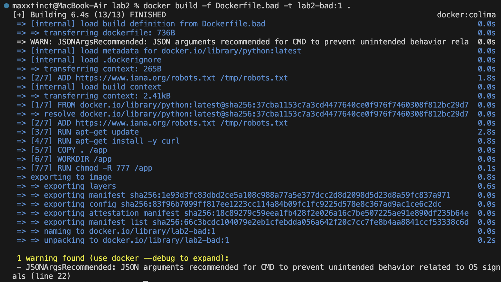


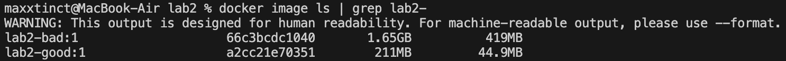

### Запуск контейнера

```bash
docker run --rm -p 8080:8080 --name lab2-good-run lab2-good:1
```

Проверка:
```bash
curl -i http://localhost:8080/
```

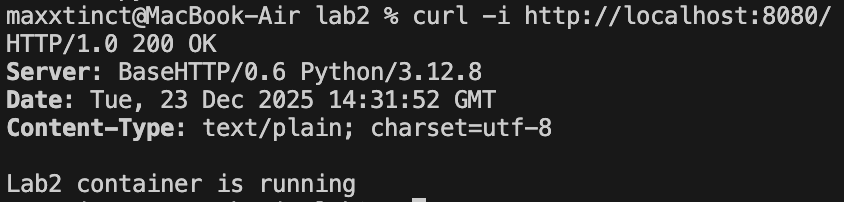

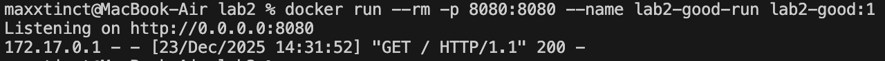

## 2. Bad practices в Dockerfile.bad

Рассмотрим частые bad practices из `Dockerfile.bad`, почему они плохие и что изменено в хорошем `Dockerfile`.

### 1) `FROM python:latest`

**Почему плохо**
- `latest` со временем меняется => сегодня образ соберётся одним способом, завтра - другим
- выше риск внезапных поломок и различий между окружениями

**Как исправлено**
- В хорошем Dockerfile используется конкретная версия: `python:3.12.8-slim-bookworm`

**Эффект**
- Более стабильные и предсказуемые сборки; проще отладка

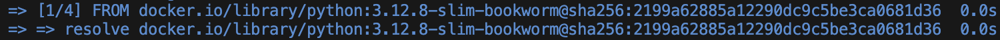

### 2) `ADD` для удалённых URL

В плохом Dockerfile есть строка:
- `ADD https://www.iana.org/robots.txt /tmp/robots.txt`

**Почему плохо**
- Скачивание на этапе build с внешнего URL - нехорошо: контент может поменяться или стать недоступным.
- кэширование и воспроизводимость ухудшаются

**Как исправлено**
- В хорошем Dockerfile удалён `ADD` с URL.
- Правило: файлы должны приходить из репозитория через `COPY`, а скачивания - выполнять осознанно и с проверкой версий/хэшей. 

**Эффект**
- Сборка меньше зависит от внешней сети и становится надёжнее

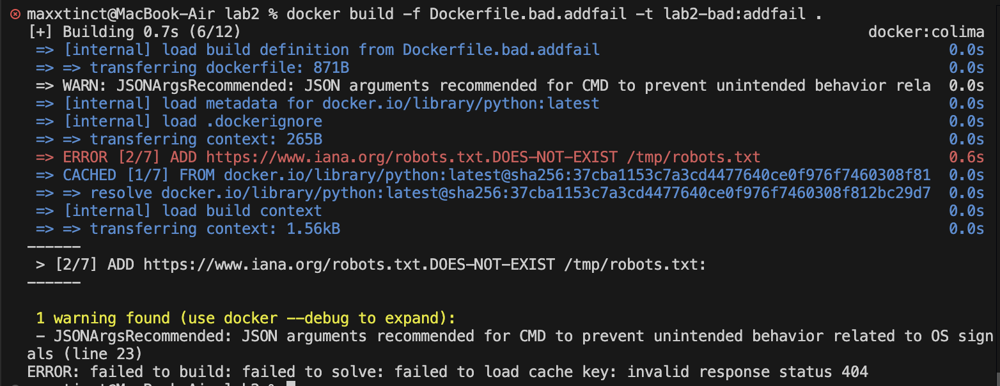

### 3) `apt-get update` и `apt-get install` в разных слоях и без очистки

В плохом Dockerfile:
- `RUN apt-get update`
- `RUN apt-get install -y curl`

**Почему плохо**
- `apt-get update` в одном слое, а install в другом ломает кэш-логику: список пакетов может устареть
- Не очищаются `apt`-листы - образ раздувается

**Как исправлено**
- В хорошем Dockerfile мы вообще не используем apt, потому что приложению не нужны системные пакеты
- если бы было нужно: объединить в один `RUN` и чистить кэш (`rm -rf /var/lib/apt/lists/*`)

**Эффект**
- Меньше размер образа и меньше мусора в слоях

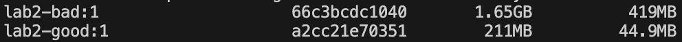

### 4) `COPY . /app`

**Почему плохо**
- В образ может уехать лишнее: `.git`, ключи, конфиги, большие файлы
- Ломается кэш: любое изменение любого файла пересобирает шаги после `COPY`

**Как исправлено**
- В хорошем Dockerfile копируется только нужное: `COPY app/server.py /app/server.py`.
- Добавлен `.dockerignore`, чтобы исключить мусор из контекста сборки

**Эффект**
- Быстрее сборка, меньше размер контекста/образа, ниже риск утечки лишних файлов

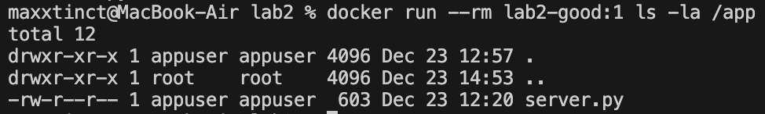

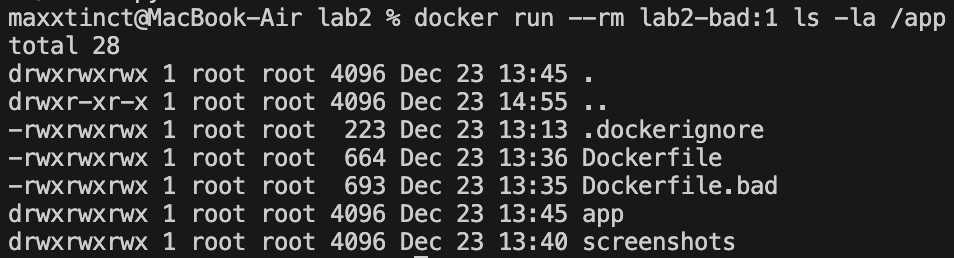

### 5) Небезопасные права `chmod -R 777 /app`

**Почему плохо**
- `777` даёт всем полный доступ на запись/исполнение => повышает риск модификации файлов внутри контейнера
- Усложняет безопасность и аудит

**Как исправлено**
- В хорошем Dockerfile создаётся отдельный пользователь `appuser`, владельцем делается `/app`, и контейнер запускается не от root

**Эффект**
- Лучше изоляция и безопасность по дефолту

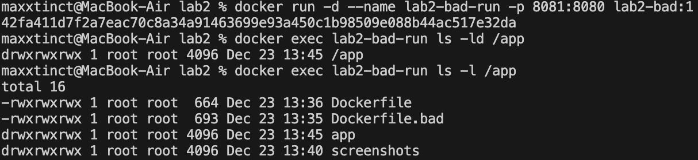

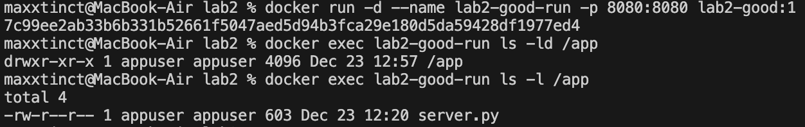

### 6) Shell-form `CMD python ...`

**Почему плохо**
- Shell-form запускается через `/bin/sh -c`, из-за этого сигналы (например `SIGTERM`) могут обрабатываться хуже

**Как исправлено**
- Exec-form: `CMD ["python", "/app/server.py"]`

**Эффект**
- Корректнее stop/restart контейнера, лучше поведение в оркестраторах

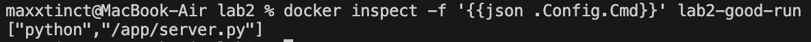

## 3. Две плохие практики при работе с контейнерами

### 1) Запуск с лишними привилегиями (`--privileged`, Docker socket в контейнер)

**Что делают**
- `docker run --privileged ...`
- или `-v /var/run/docker.sock:/var/run/docker.sock`

**Почему плохо**
- Это фактически почти root на хосте, т.е. потенциальный атакер сможет управлять Docker/хостом

**Как правильно**
- Не давать `--privileged` без реальной необходимости
- Не монтировать docker.sock в обычные контейнеры
- Давать минимум capability/доступов, использовать rootless/не-root, read-only FS где возможно

### 2) Запуск без ограничений ресурсов и без политики рестарта

**Что делают**
- Запускают контейнер как есть без лимитов CPU/RAM и без `--restart`.

**Почему плохо**
- Контейнер может съесть всю память/CPU и положить хост
- При падении контейнер не поднимется автоматически

**Как правильно**
- Задавать лимиты: `--memory`, `--cpus`
- Настраивать рестарт-политику (`--restart=unless-stopped` например)

Пример:
```bash
docker run --rm -p 8080:8080 \
  --cpus="1.0" --memory="256m" \
  --restart=unless-stopped \
  --name lab2-good-run lab2-good:1
```