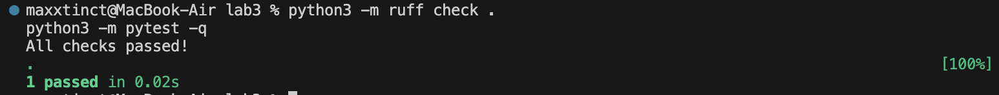
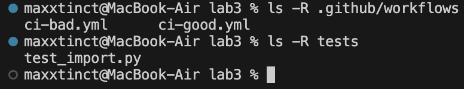

# Лаба 3 - CI/CD bad practices

Задание:
1) написать “плохой” CI/CD файл, который работает, но содержит минимум 3 bad practices
2) написать “хороший” CI/CD файл, где эти bad practices исправлены
3) описать каждую bad practice: почему плохо, как исправлено, и эффект

## Что такое CI/CD

- **CI (Continuous Integration)** - автоматические проверки при push/PR: линт, тесты, сборка.
- **CD (Continuous Delivery/Deployment)** - автоматическая доставка/деплой после успешного CI.

В этой лабе сделан CI (линт + тесты)

Прогон команд, которые выполняет CI:

```bash
python3 -m pip install -r requirements-dev.txt
python3 -m ruff check .
python3 -m pytest -q
```



Структура файлов:

```bash
ls -R .github/workflows
ls -R tests
```



## Где лежат файлы

- Плохой воркфлоу: `.github/workflows/ci-bad.yml`
- Хороший воркфлоу: `.github/workflows/ci-good.yml`

## Bad practices в `ci-bad.yml` и исправления в `ci-good.yml`

### 1) Слишком частые/лишние триггеры

**Плохо потому что**
- тратит лишние минуты CI, мусор в логах
- в небольших проектах почасовое расписание чаще всего не нужно

**Исправление**
- в хорошем воркфлоу запуск только на `push`/`pull_request` в `main`

**Эффект**
- меньше лишних запусков, быстрее обратная связь, проще история билдов

bad:
```yaml
on:
  push:
  pull_request:
  schedule:
    - cron: "0 * * * *"
```

good:
```yaml
on:
  push:
    branches: ["main"]
  pull_request:
    branches: ["main"]
```

### 2) Слишком широкие разрешения: `permissions: write-all`

**Плохо потому что**
- по умолчанию лучше принцип минимальных привилегий
- при компрометации атакующий получает много прав

**Исправление**
- в хорошем воркфлоу выставлено:
  - `permissions: contents: read`

**Эффект**
- безопаснее, т.к. меньше прав при компрометации

bad:
```yaml
permissions: write-all
```

good:
```yaml
permissions:
  contents: read
```

### 3) Непинованные Python `3.x`, runner `ubuntu-latest`

**Плохо потому что**
- `3.x` и `ubuntu-latest` со временем меняются => поведение может измениться
- выше риск внезапных поломок и различий между окружениями

**Исправление**
- в хорошем воркфлоу:
  - Python `3.12`
  - runner `ubuntu-24.04`

**Эффект**
- воспроизводимость и стабильность результатов

bad:
```yaml
runs-on: ubuntu-latest
...
with:
  python-version: "3.x"
```

good:
```yaml
runs-on: ubuntu-24.04
...
with:
  python-version: "3.12"
```

### 4) Нет кэша зависимостей (каждый раз скачивается одно и то же)

**Плохо потому что**
- медленнее пайплайн
- лишняя нагрузка на сеть и PyPI

**Исправление**
- в хорошем воркфлоу включён кэш pip через `actions/setup-python`:
  - `cache: pip`
  - `cache-dependency-path: requirements-dev.txt`

**Эффект**
- быстрее повторные раны CI

good:
```yaml
- uses: actions/setup-python@v5
  with:
    python-version: "3.12"
    cache: pip
    cache-dependency-path: |
      requirements-dev.txt
```

### 5) Всё в одном шаге + `continue-on-error: true`

**Плохо потому что**
- сложнее понять, где именно упало
- `continue-on-error` может скрыть реальную поломку

**Исправление**
- в хорошем воркфлоу отдельные шаги `lint` и `test`
- нет `continue-on-error`

**Эффект**
- понятные логи, корректный статус пайплайна

bad:
```yaml
- name: все в одном шаге
  continue-on-error: true
  run: |
    ruff check .
    python -m pytest -q
```

good:
```yaml
jobs:
  lint:
    ...
  test:
    needs: [lint]
    ...
```